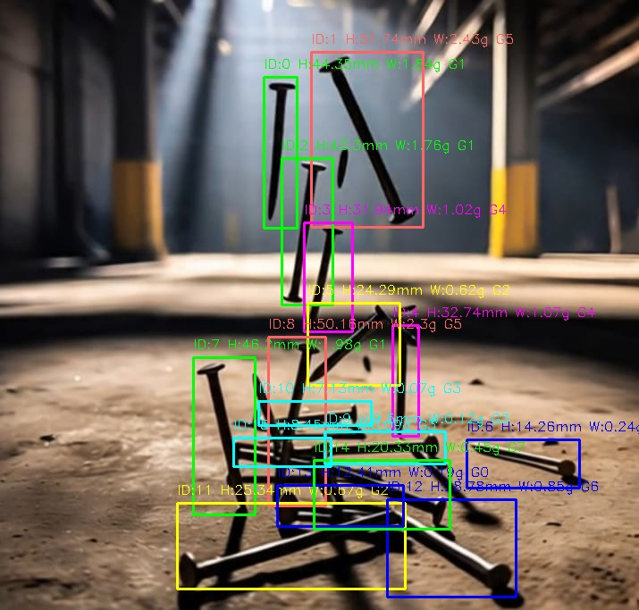

# Nail Detection and Analysis 🔩

This project is an AI/ML pipeline that detects nails from an image, estimates their physical properties, and groups similar nails together using unsupervised learning.

## 📸 Input vs Output

### ➡️ Original Test Image


### ✅ Output with Detections



---
## 📤 Output Summary

The model successfully detected and analyzed the nails in the test image.

**Total Nails Detected:** `16`

| Nail ID | Height (mm) | Weight (g) | Group |
|---------|--------------|-------------|--------|
| 0       | 44.35        | 1.84        | 1      |
| 1       | 51.74        | 2.43        | 5      |
| 2       | 43.30        | 1.76        | 1      |
| 3       | 31.94        | 1.02        | 4      |
| 4       | 32.74        | 1.07        | 4      |
| 5       | 24.29        | 0.62        | 2      |
| 6       | 14.26        | 0.24        | 0      |
| 7       | 46.20        | 1.98        | 1      |
| 8       | 50.16        | 2.30        | 5      |
| 9       | 9.50         | 0.12        | 3      |
| 10      | 7.13         | 0.07        | 3      |
| 11      | 25.34        | 0.67        | 2      |
| 12      | 28.78        | 0.85        | 6      |
| 13      | 12.41        | 0.19        | 0      |
| 14      | 20.33        | 0.45        | 7      |
| 15      | 8.45         | 0.09        | 3      |

Grouped nails represent similar nails (in height ± tolerance and weight ± tolerance).

---

## 🧠 Approach

### 🧰 1. Dataset and Annotation

- A few images of nails (around 8–10) were collected for training.
- Each image was annotated using [LabelImg](https://github.com/tzutalin/labelImg) tool.
- The annotations were saved in **YOLO format**, which includes:
 ```bash
class_id x_center y_center width height
 ```

 - These `.txt` label files were saved alongside their corresponding image files.

---

### 🧠 2. Model Training (YOLOv5)

- The YOLOv5 architecture was used to train a nail detector on the labeled data.
- The best model weights (`best.pt`) were saved after training.
- Detection on new images was performed using the trained YOLO model.

---

### 📐 3. Estimating Height and Weight

- For each detected nail, the bounding box height (in pixels) was converted to millimeters using a **pixel-to-mm scale** (manually assumed or estimated).
- Height estimation formula:
 ```bash
height_mm = pixel_height * pixel_to_mm_ratio
 ```
 - Weight was estimated using a formula:
 ```bash
weight = 0.002 * (height_mm ^ 1.8)
 ```
This assumes a rough proportional relationship based on nail dimensions and density.

---

### 🤝 4. Grouping Similar Nails

- Nails were grouped into similar pairs using **K-Means clustering** based on `[height_mm, weight_g]`.
- Each group was assigned a distinct color in the output image.

---

### ✅ 5. Output

- The script overlays:
- Bounding boxes
- Height & weight estimates
- Group IDs
- It also saves the output as an annotated image.

---

## Made by Khushi
